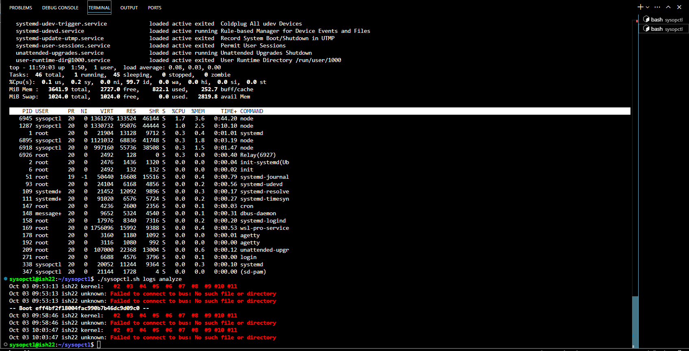
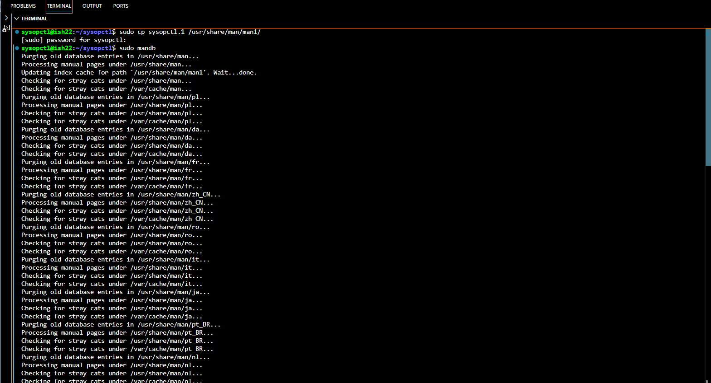
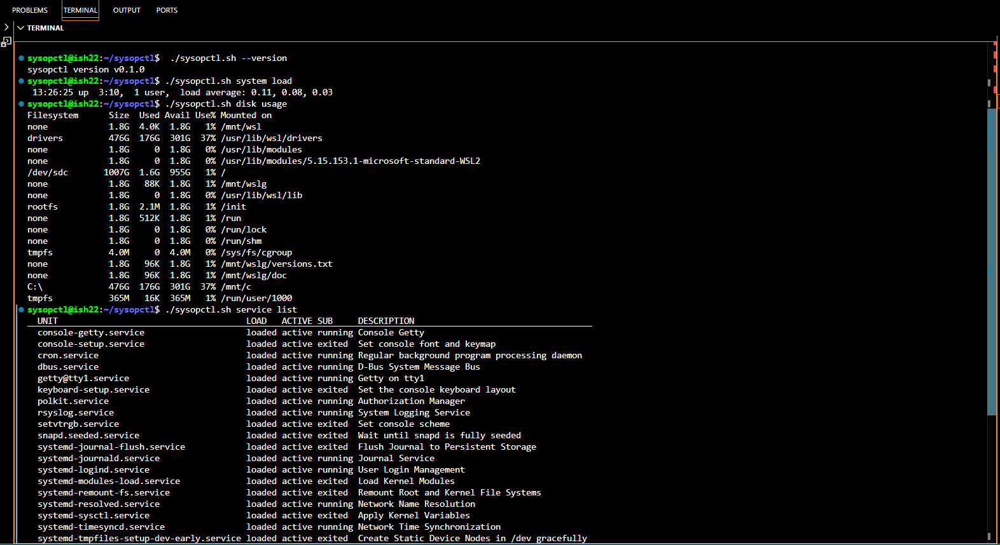
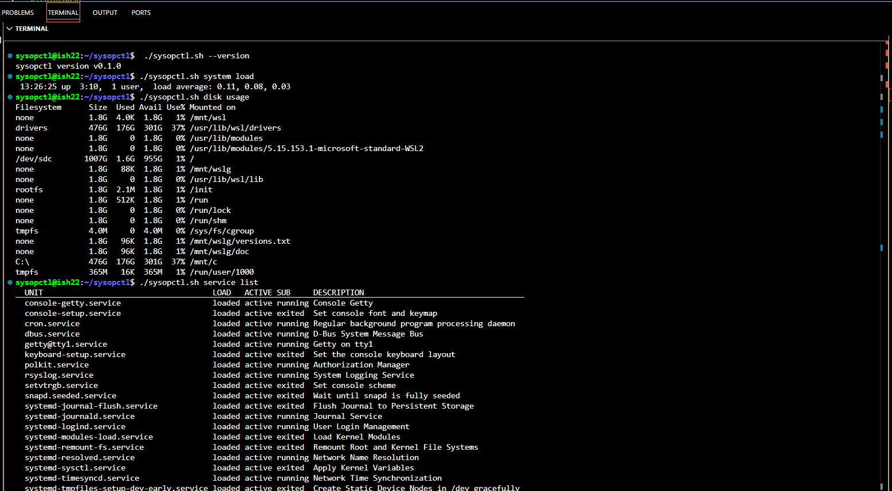

## Overview of sysopctl - System Operation Command

`sysopctl` is a custom Bash command designed to manage system services, monitor processes, and handle system health tasks in a Linux environment. This project was built to enhance system administration capabilities by offering a simplified, easy-to-use command-line tool.


## Features
- **Service Management**: Start, stop, and list services.
  - List running services: `./sysopctl.sh service list`
  - Start a service: `./sysopctl.sh service start <service-name>`
  - Stop a service: `./sysopctl.sh service stop <service-name>`
  
- **System Load Monitoring**: View system load averages.
  - View system load: `./sysopctl.sh system load`
  - Monitor processes: `./sysopctl.sh process monitor`
  
- **Disk Usage Monitoring**: Check disk usage by partitions.
  - Check disk usage: `./sysopctl.sh disk usage`
  
- **Log Analysis**: Analyze critical system logs.
  - Analyze system logs: `./sysopctl.sh logs analyze`
  
- **File Backup**: Perform system file backups using `rsync`.
  - Backup system files: `./sysopctl.sh backup <path>`

- **Process Monitoring**: View real-time process activity.  


## Installation

To install and use `sysopctl`, follow these steps:

1. **Clone the Repository**:
   ```bash
   git clone https://github.com/shorabh-singh/XenonStack-shorabh_Task
   ```

2. **Make the Script Executable**:
   ```bash
   chmod +x sysopctl
   ```

3. **(Optional) Move the Script to a Directory in Your PATH**:
   This allows you to run `sysopctl` from anywhere in your terminal.
   ```bash
   sudo mv sysopctl /usr/local/bin/
   ```

## Usage

Here’s how to use `sysopctl`:

1. **Help**: Display available commands and options:
   ```bash
   sysopctl --help
   ```

2. **Version**: Display the current version of `sysopctl`:
   ```bash
   sysopctl --version
   ```

3. **List Running Services**: Show all active services (similar to `systemctl list-units --type=service`):
   ```bash
   sysopctl service list
   ```

4. **Start a Service**: Start a specific service (similar to `systemctl start`):
   ```bash
   sysopctl service start <service-name>
   ```

5. **Stop a Service**: Stop a specific service (similar to `systemctl stop`):
   ```bash
   sysopctl service stop <service-name>
   ```

6. **Check Disk Usage**: Show disk usage by partitions (similar to `df -h`):
   ```bash
   sysopctl disk usage
   ```

7. **Monitor Processes**: Display real-time process activity (similar to `top`):
   ```bash
   sysopctl process monitor
   ```

8. **Analyze Logs**: Analyze recent critical system logs (using `journalctl`):
   ```bash
   sysopctl logs analyze
   ```

9. **Backup Files**: Perform a system file backup using `rsync`:
   ```bash
   sysopctl backup <path-to-backup>
   ```

## Screenshots






## Example

Here’s an example of how to start the `cron` service using `sysopctl`:

```bash
sysopctl service start cron
```

And an example to check disk usage:

```bash
sysopctl disk usage
```

## Requirements

- **Bash Shell**: `sysopctl` is a Bash script and requires a Bash shell environment.
- **Systemd**: The service management feature relies on `systemctl`, which is available on systemd-based Linux distributions.
- **Rsync**: Required for the backup feature. 


## Documentation
For detailed documentation and command options, run:
bash
./sysopctl.sh --help
